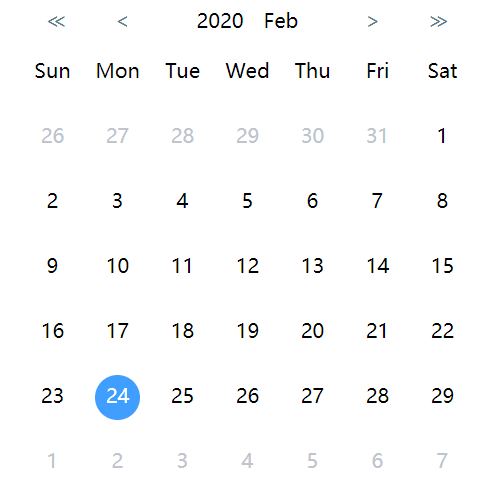

# el-calendar

> element-ui style calendar widget, typescript friendly



## [Try it](https://mrhanson.github.io/el-calendar/)

## Install

```bash
# npm
npm i @mrhanson/el-calendar

# yarn
yarn add @mrhanson/el-calendar
```

## Usage

```html
<template>
  <Calendar ref="calendar" v-model="selectedDate" comment="*some comment"></Calendar>
</template>

<script>
  import Calendar from '@mrhanson/el-calendar'

  export default {
    components: { Calendar }

    data() {
      return {
        selectedDate: new Date()
      }
    }
  }
</script>
```

## Props

### value/v-model

- type: Date
- default: `[]`

Selected Date value

### today

- type: Date
- default: `new Date()`

### weekText

- type: Array
- default: `['日', '一', '二', '三', '四', '五', '六']`

### bannerYearText

- type: String
- default: `'年'`

### bannerMonthText

- type: String
- default: `'月'`

### markArr

- type: Array
- default: falsly array with length of current month's max date base on prop `today`

> Notice: The length of `markArr` must be same as the value of current month's max date

### comment

- type: String
- default: `''`

## Events

### premonth

emit when vision moves to previous month

### nextmonth

emit when vision moves to next month

## Methods

| Methods                           | Params                                               | Description                              |
| --------------------------------- | ---------------------------------------------------- | ---------------------------------------- |
| backToToday()                     |                                                      | set value & month visision back to today |
| toPreMonth()                      |                                                      | set vision to previous month             |
| toNextMonth()                     |                                                      | set vision to previous month             |
| toSpecificDate(year, month, date) | year: number(integer), month: integer, date, integer |                                          |
